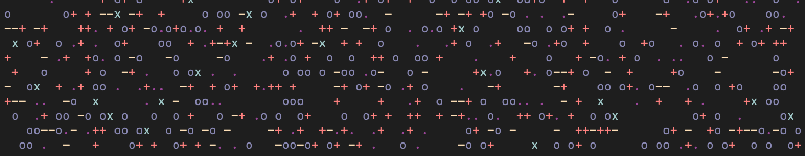
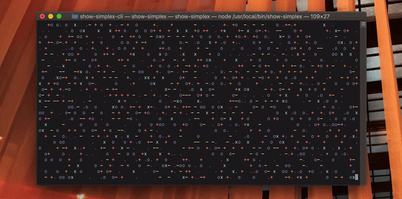
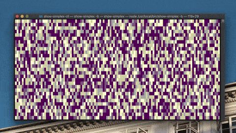
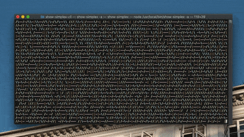
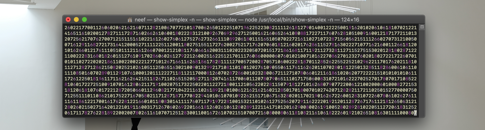

# show-simplex-cli

A CLI that displays an animated ASCII [simplex noise](https://en.wikipedia.org/wiki/Simplex_noise)
field in your terminal. You may have to squint a bit or reduce your font-size to see the patterns
emerge, but they're there!

>❇️ Want to run this CLI with a _much_ faster framerate? Well [I've re-written it in Rust](https://github.com/neefrehman/show-simplex-rs), so you can!

## npx execution

Run the below command to execute `show-simplex-cli` without installing the module globally

```shell
npx show-simplex-cli show-simplex
```



## Additional options

| Option            | Description                                            |
| ----------------- | ------------------------------------------------------ |
| `-b`, `--block`   | Display block alternative visualisation                |
| `-a`, `--angle`   | Display angle alternative visualisation                |
| `-n`, `--numeric` | Display numeric values                                 |
| `-t`, `--timeout` `<milliseconds>` | Set a timeout for the visualisation   |

## Alternate visualisations

`show-simplex` also has two alternative visualisations of the simplex noise field: `block` and `angle`.
To see them, use the appropriate command flags below.

```shell
show-simplex -b     # or --block
```

```shell
show-simplex -a     # or --angle
```

<table>
  <tr>
    <td></td>
    <td></td>
  </tr>
</table>

## Numeric value display

A `number` option is also available under the `-n` flag, to display the numeric value of the noise field
at each point. This can be used alongside `block`, but will overwrite the character shown for other visualisations.

```shell
show-simplex -n     # or --number, can be used alongside -b
```



## Timeout

To stop the visualisation after a set time, set a millisecons value with the timeout flag. This is useful if you
want to use this as a small visualisation in another cli, for example during loading or after a succesful run.

```shell
show-simplex -t 3000     # Will stop and clear the terminal after 3 seconds
```

## Global Installation

To install the package on your device and call the local command whenever you like, use a regular `npm install -g`
like below.

```shell
npm install show-simplex-cli -g
```

```shell
show-simplex
```

## License

This package is [MIT Licensed](https://github.com/neefrehman/show-simplex/blob/master/LICENSE).
