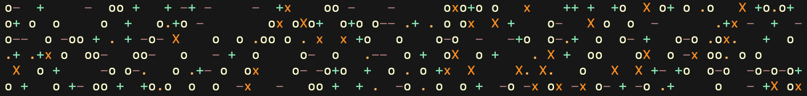

# show-simplex-cli

A CLI that displays an animated ASCII [simplex noise](https://en.wikipedia.org/wiki/Simplex_noise) field in your terminal. You may have to squint a bit or reduce your font-size to see the patterns emerge.

## npx execution

Run the below command to execute `show-simplex-cli` without installing the modula globally

```shell
npx show-simplex-cli show-simplex
```


## Global Installation

To install the package on your device you can use a regular `npm install -g`, and then can call the local command whenever you like.

```shell
npm install show-simplex-cli -g
```

```shell
show-simplex
```

## Options

`show-simplex` has two alternate visualisations of the simplex noise field: `angle` and `block`. To see them, use the appropriate command flags below.

```shell
show-simplex -b     # or --block
show-simplex -a     # or --angle
```

<table>
  <tr>
    <td></td>
    <td></td>
  </tr>
</table>
